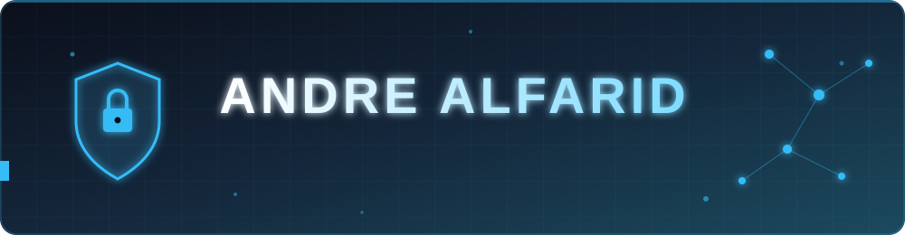

 

## 👨‍💻 Tentang Saya

## 🎯 Sedang Saya Pelajari

## 🛠️ Tech Stack

## 🎮 Di Luar Layar

## 📊 Aktivitas GitHub

  

<!--
  OPSIONAL: animasi ular (snake). Aktifkan setelah workflow "Generate Snake Animation"
  berhasil dijalankan (tab Actions), lalu hapus tanda komentar ini.

  
<picture>
  <source media="(prefers-color-scheme: dark)" srcset="https://raw.githubusercontent.com/andrealfarid1-maker/andrealfarid1-maker/output/github-snake-dark.svg">
  
</picture>
-->

 

Hadapi semua rintangan walaupun sulit untuk diterima 💪

